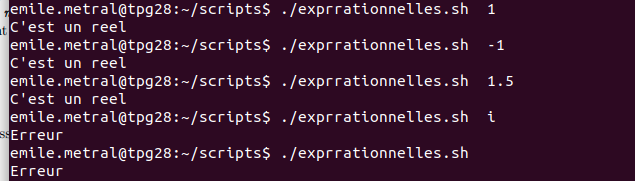
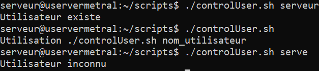
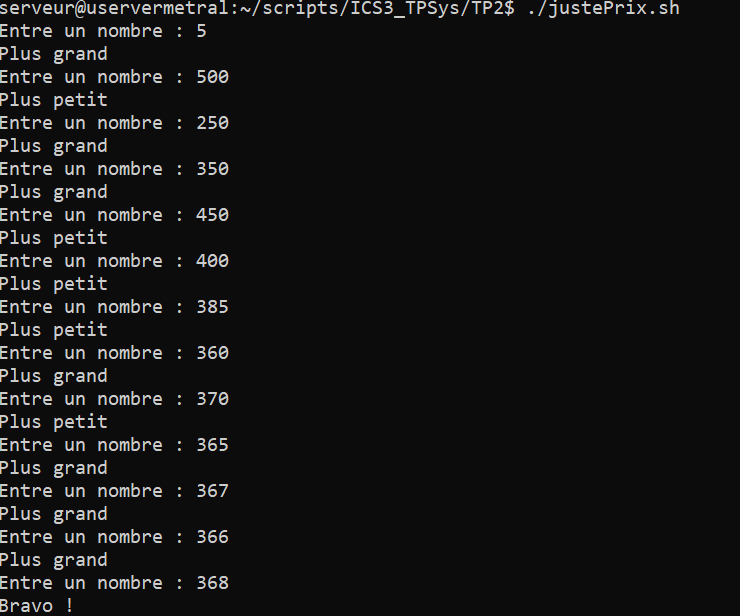
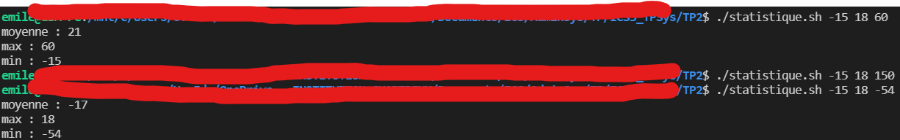
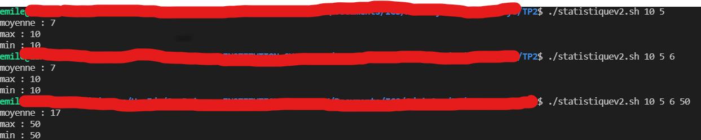
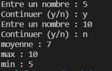

# TP1
*Emile Metral ICS 3*
---
## Exercice 1. Variables d’environnement 
1. Dans quels dossiers bash trouve-t-il les commandes tapées par l’utilisateur ? 
`Les commandes tapées par l’utilisateur sont cherchées dans les répertoires contenus dans la variable d'environnement PATH`

2. Quelle variable d’environnement permet à la commande cd tapée sans argument de vous ramener dans votre répertoire personnel ? 
`La variable d'env. $HOME `


3. Explicitez le rôle des variables LANG, PWD, OLDPWD, SHELL. 
```
LANG⇒ Variable qui définit la langue du système et du clavier
PWD⇒ Variable qui donne l'emplacement complet du dossier actuel 
OLDPWD⇒  Variable qui donne l'emplacement complet du dossier précédent
SHELL⇒ Le type de shell utilisé
 ```

4. Créez une variable locale MY_VAR (le contenu n’a pas d’importance). Vérifiez que la variable existe. 
```
MY_VAR=5
echo $MY_VAR
```

5. Tapez ensuite la commande bash. Que fait-elle ? La variable MY_VAR existe-t-elle ? Expliquez. A la fin de cette question, tapez la commande exit pour revenir dans votre session initiale. 
```bash permet de lancer un script; La variable MY_VAR n'existe pas dans la session créé par le bash. ```

6. Transformez MY_VAR en une variable d’environnement et recommencez la question précédente. Expliquez. 
```
export TESTVAR=5 ; printenv TESTVAR
```
Les variables d'environnements sont des variables globales accessible partout.

7. Créer la variable d’environnement NOMS ayant pour contenu vos noms de binômes séparés par un espace. Afficher la valeur de NOMS pour vérifier que l’affectation est correcte. 
```export NOM="Emile" ; printenv NOM```

8. Ecrivez une commande qui affiche ”Bonjour à vous deux, binôme1 binôme2 !” (où binôme1 et binôme2 sont vos deux noms) en utilisant la variable NOMS. 
`echo "Bonjour vous deux $NOM"`

9. Quelle différence y a-t-il entre donner une valeur vide à une variable et l’utilisation de la commande unset ? 
Unset supprime la variable tandis que une valeur vide change juste la valeur de la variable sans la supprimer

 10. Utilisez la commande echo pour écrire exactement la phrase : $HOME = chemin (où chemin est votre dossier personnel d’après bash)

 `echo "\$HOME =  $HOME"`
## Programmation Bash 

Vous enregistrerez vos scripts dans un dossier script que vous créerez dans votre répertoire personnel. Tous les scripts sont bien entendu à tester. Ajoutez le chemin vers script à votre PATH de manière permanente.

## Exercice 2. Contrôle de mot de passe 

Écrivez un script testpwd.sh qui demande de saisir un mot de passe et vérifie s’il correspond ou non au contenu d’une variable PASSWORD dont le contenu est codé en dur dans le script. Le mot de passe saisi par l’utilisateur ne doit pas s’afficher. 
** Remarque : Il est bon de mettre un caractère avant chaque variable lors des comparaisons ** 
```
#!/bin/bash
PSWD="123+aze"
read -sp 'Entre le mot de passe : ' SAISI

if [  x$PSWD = x$SAISI ]; then
        echo "C'est bon"
else
        echo "C'est pas bon"
fi
```


## Exercice 3. Expressions rationnelles 

Ecrivez un script qui prend un paramètre et utilise la fonction suivante pour vérifier que ce paramètre est un nombre réel 
 Il affichera un message d’erreur dans le cas contraire. 

```
#!/bin/bash

function is_number()
{
	re='^[+-]?[0-9]+([.][0-9]+)?$'

	if ! [[ $1 =~ $re ]] ; then
		return 1
	else
		return 0
	fi
}

is_number $1
nbr=$?

if [ $nbr -eq 0 ]; then
	echo "C'est un reel"
else
	echo "Erreur"
fi

```




## Exercice 4. Contrôle d’utilisateur 

Écrivez un script qui vérifie l’existence d’un utilisateur dont le nom est donné en paramètre du script. Si le script est appelé sans nom d’utilisateur, il affiche le message : ”Utilisation : nom_du_script nom_utilisateur”, où nom_du_script est le nom de votre script récupéré automatiquement (si vous changez le nom de votre script, le message doit changer automatiquement) 

```
#!/bin/bash

function is_user {
    userExist=0
    for user in $(cut -d: -f1 /etc/passwd | sort -r); do
        if [ x$user = x$1 ]; then
            echo 'Utilisateur existe'
            userExist=1
        fi
    done
    return $userExist
}

if [ $# -ge 1 ]; then
    is_user $1
    if [ $? -ne 1 ]; then
        echo 'Utilisateur inconnu'
    fi
else
    echo "Utilisation $0 nom_utilisateur"
fi

```



## Exercice 5. Factorielle

 Écrivez un programme qui calcule la factorielle d’un entier naturel passé en paramètre (on supposera que l’utilisateur saisit toujours un entier naturel). 
```
#!/bin/bash
factorielle=1

for i in $(seq 1 $1); do
    factorielle=$(($factorielle*$i))
done 

echo $factorielle
```


## Exercice 6. Le juste prix
 Écrivez un script qui génère un nombre aléatoire entre 1 et 1000 et demande à l’utilisateur de le deviner. Le programme écrira ”C’est plus !”, ”C’est moins !” ou ”Gagné !” selon les cas (vous utiliserez $RANDOM). 
```
#!/bin/bash
nombre=$(( $RANDOM % 1000 + 1 ))
findIt=0


while [ "$findIt" -ne 1 ]
do
    read -p "Entre un nombre : " SAISI

    if [ "$SAISI" -gt "$nombre" ]; then
        echo "Plus petit"
    fi
    if [ "$SAISI" -lt "$nombre" ]; then
        echo "Plus grand"
    fi
    if [ "$SAISI" -eq "$nombre" ]; then
        echo "Bravo !"
        findIt=1
    fi
done

```

## Exercice 7. Statistiques 
1. Écrivez un script qui prend en paramètres trois entiers (entre -100 et +100) et affiche le min, le max et la moyenne. Vous pouvez réutiliser la fonction de l’exercice 3 pour vous assurer que les paramètres sont bien des entiers. 

```
#!/bin/bash

function is_number()
{
	re='^[+-]?[0-9]+([.][0-9]+)?$'

	if ! [[ $1 =~ $re ]] ; then
		return 1
	else
		return 0
	fi
}

function is_inrange()
{
    if  [[ "$1" -ge -100  &&  "$1" -le 100 && "$2" -ge -100 && "$2" -le 100  &&  "$3" -ge -100  &&  "$3" -le 100 ]]
    then
        return 0
    else
        return 1
    fi
}

function get_max()
{
    if [[ "$1" -gt "$2"  &&  "$1" -gt "$2" ]]; then
        max="$1"
    fi
    if [[ "$3" -gt "$2"  &&  "$3" -gt "$1" ]]; then
        max="$3"
    fi
    if [[ "$2" -gt "$1"  &&  "$2" -gt "$3" ]]; then
        max="$2"
    fi

    echo "max : $max"
}

function get_min()
{
    if [[ "$1" -lt "$2"  &&  "$1" -lt "$2" ]]; then
        min="$1"
    fi
    if [[ "$3" -lt "$2"  &&  "$3" -lt "$1" ]]; then
        min="$3"
    fi
    if [[ "$2" -lt "$1"  &&  "$2" -lt "$3" ]]; then
        min="$2"
    fi
    echo "min : $min"
}

function get_average()
{
    somme=0
    nbrElement=0
    while (("$#")) 
    do
        somme=$(("$somme"+"$1"))
        nbrElement=$(("$nbrElement"+1))
        shift
    done
    moyenne=$(("$somme"/"$nbrElement"))
    echo "moyenne : $moyenne"
}

is_number "$@"
nbr1=$?


is_inrange "$@"
goodRange=$?

if [[ $nbr1 -eq 0  && $goodRange -eq 0 ]]
then
    get_average "$@"
    get_max "$@"
    get_min "$@"
fi
```



2. Généralisez le programme à un nombre quelconque de paramètres (pensez à SHIFT) 

```
#!/bin/bash

function is_number()
{
	re='^[+-]?[0-9]+([.][0-9]+)?$'

	if ! [[ $1 =~ $re ]] ; then
		return 1
	else
		return 0
	fi
}

function is_inrange()
{
    while (("$#")) 
    do
        if [[ "$1" -le -100  ||  "$1" -ge 100 ]] 
        then
            return 1
        fi
        shift
    done
    return 0
}

function get_max()
{
    max="$1"
    while (("$#")) 
    do
        if [[ "$1" -gt "$max" ]] 
        then
            max="$1"
        fi
        shift
    done
    

    echo "max : $max"
}

function get_min()
{
    min="$1"
    while (("$#")) 
    do
        if [[ "$1" -lt "$min" ]] 
        then
            min="$1"
        fi
        shift
    done
    echo "min : $min"
}

function get_average()
{
    somme=0
    nbrElement=0
    while (("$#")) 
    do
        somme=$(("$somme"+"$1"))
        nbrElement=$(("$nbrElement"+1))
        shift
    done
    moyenne=$(("$somme"/"$nbrElement"))
    echo "moyenne : $moyenne"
}

is_number "$@"
nbr1=$?


is_inrange "$@"
goodRange=$?

if [[ $nbr1 -eq 0  && $goodRange -eq 0 ]]
then
    get_average "$@"
    get_max "$@"
    get_min "$@"
fi
```



3. Modifiez votre programme pour que les notes ne soient plus données en paramètres, mais saisies et stockées au fur et à mesure dans un tableau. 

```
#!/bin/bash

function is_number()
{
	re='^[+-]?[0-9]+([.][0-9]+)?$'

	if ! [[ $1 =~ $re ]] ; then
		return 1
	else
		return 0
	fi
}

function is_inrange()
{
    while (("$#")) 
    do
        if [[ "$1" -le -100  ||  "$1" -ge 100 ]] 
        then
            return 1
        fi
        shift
    done
    return 0
}

function get_max()
{
    max="$1"
    while (("$#")) 
    do
        if [[ "$1" -gt "$max" ]] 
        then
            max="$1"
        fi
        shift
    done
    

    echo "max : $max"
}

function get_min()
{
    min="$1"
    while (("$#")) 
    do
        if [[ "$1" -lt "$min" ]] 
        then
            min="$1"
        fi
        shift
    done
    echo "min : $min"
}

function get_average()
{
    somme=0
    nbrElement=0
    while (("$#")) 
    do
        somme=$(("$somme"+"$1"))
        nbrElement=$(("$nbrElement"+1))
        shift
    done
    moyenne=$(("$somme"/"$nbrElement"))
    echo "moyenne : $moyenne"
}

continuer="y"
index=0
tab=()


while [ x$continuer = x"y" ] 
do
    read -p "Entre un nombre : " SAISI
    is_number "$SAISI"
    nbr1=$?

    is_inrange "$SAISI"
    goodRange=$?

    if [[ $nbr1 -eq 0  && $goodRange -eq 0 ]]
    then
        tab[index]="$SAISI"
    fi

    index=$(("$index"+1))
    read -p "Continuer (y/n) : " continuer
done


get_average ${tab[*]}
get_max ${tab[*]}
get_min ${tab[*]}

```


